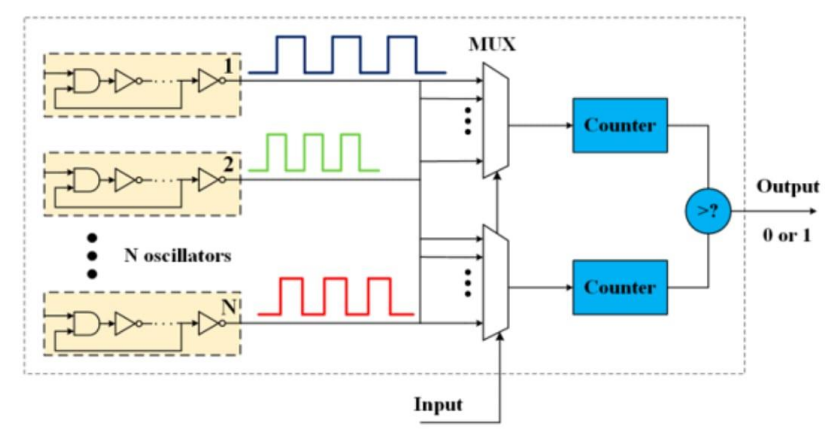
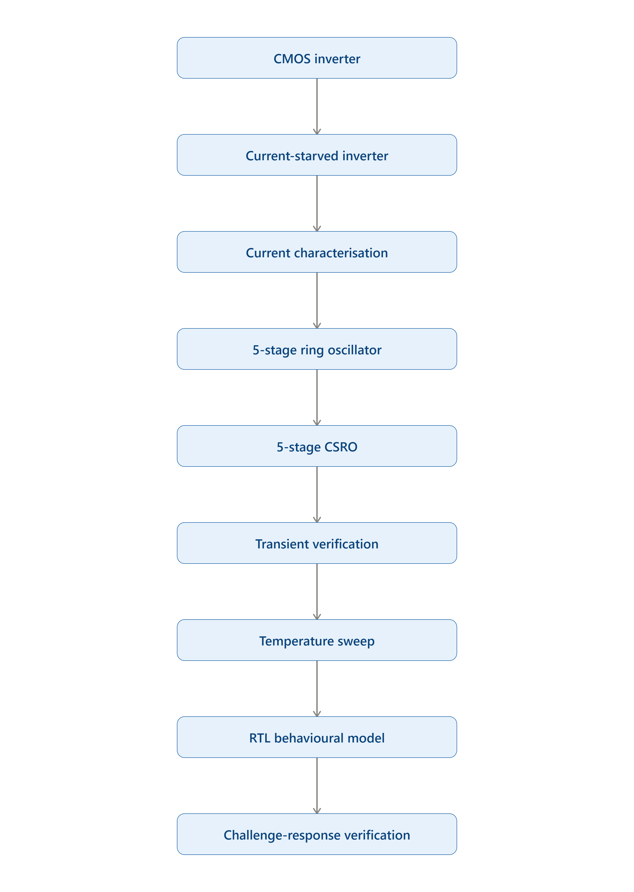
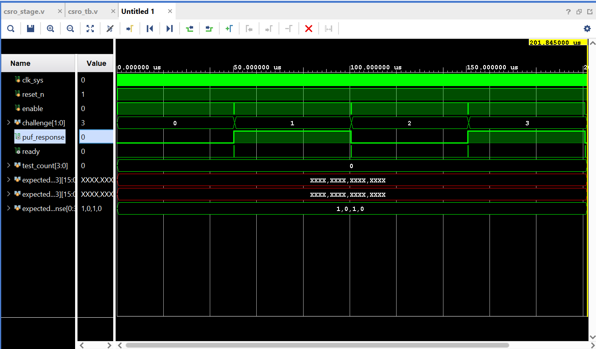

# CSRO-Based Green Physical Unclonable Function (PUF)

A Current-Starved Ring Oscillator (CSRO)-Based Physical Unclonable Function for Low-Power IoT Hardware Authentication.


> Developed as part of the **Samsung Chip Design Studio (IIIT Bangalore)** using Cadence Virtuoso, Spectre, and Verilog.

---

## Project Overview

This repository documents the design, simulation, and behavioural verification of a Current-Starved Ring Oscillator (CSRO) based Physical Unclonable Function (PUF). The project was carried out as part of the Samsung Chip Design Studio at IIIT Bangalore.

A Physical Unclonable Function uses small manufacturing variations in silicon to generate a unique hardware fingerprint. Instead of storing a secret key directly in memory, a PUF generates a device-specific response when a challenge input is applied.

Ring Oscillator PUFs compare the oscillation frequencies of different ring oscillators. Since each oscillator has slight delay variations due to process mismatch, the comparison output can be used to generate a response bit.

In this project, a Current-Starved Ring Oscillator was used to reduce power consumption and control oscillation delay. Unlike a normal ring oscillator where the inverters are directly connected to VDD and GND, the CSRO uses current-limiting transistors to restrict current flow and improve delay controllability.

The term Green PUF refers to a PUF architecture focused on low power consumption, reliability, and secure authentication for low-energy devices such as IoT nodes, wearables, and medical electronics.

---

## Motivation

The rapid growth of IoT devices creates a need for secure, lightweight, and energy-efficient hardware authentication. Traditional PUF designs can suffer from high power consumption, instability under temperature variation, and dependence on additional error correction logic.

The motivation of this project was to explore a low-power PUF design that reduces power consumption while maintaining reliable challenge-response behaviour.

---

## Objectives

The main objectives of this project were:

- Study the working principle of Ring Oscillator based PUFs.
- Design and simulate a Current-Starved Ring Oscillator using Cadence Virtuoso.
- Compare normal RO and CSRO behaviour through transient simulations.
- Perform device-level characterisation using DC and transient analysis.
- Analyse temperature sensitivity of the current-starved structure.
- Develop an RTL behavioural model for challenge-response verification.
- Connect transistor-level circuit behaviour with digital verification flow.

---

## Tools Used

| Category | Tools |
|---|---|
| Circuit Design | Cadence Virtuoso |
| Circuit Simulation | Spectre |
| RTL Design | Verilog |
| RTL Simulation | Vivado / NCLaunch |
| Documentation | GitHub Markdown, PowerPoint |

---

# Architecture

The proposed Physical Unclonable Function (PUF) employs a **Current-Starved Ring Oscillator (CSRO)** architecture to generate device-specific responses for hardware authentication.

A challenge input selects one pair of oscillators through a multiplexer network. The oscillation frequencies of the selected pair are measured over a fixed evaluation interval using digital counters. A comparator then determines which oscillator produced a higher count, generating a single response bit.

Since the oscillation frequency depends on intrinsic transistor delay variations, each fabricated device exhibits a unique challenge-response behaviour, making the architecture suitable for lightweight hardware security applications.

<p align="center">

</p>

---

# Design Methodology

Rather than directly implementing the complete PUF, the design was developed incrementally. Each circuit block was independently designed, verified, and characterized before integrating it into the complete architecture.

<p align="center">

</p>

The development flow consisted of:

- CMOS inverter characterization
- Current-starved inverter implementation
- Current characterization
- 5-stage Ring Oscillator implementation
- 5-stage Current-Starved Ring Oscillator (CSRO)
- Transient verification
- Temperature sweep analysis
- RTL behavioural modelling
- Challenge-response verification

---

# Cadence Circuit Implementation

The transistor-level implementation was carried out in **Cadence Virtuoso** using Spectre simulations.

The implementation followed a bottom-up approach:

### 1. CMOS Inverter

A reference CMOS inverter was designed and characterized to obtain balanced switching behaviour.

### 2. Current-Starved Inverter

Additional PMOS and NMOS current-limiting transistors were incorporated to regulate the charging and discharging current, thereby controlling oscillation frequency and reducing dynamic power.

### 3. Five-Stage Current-Starved Ring Oscillator

Five current-starved inverter stages were connected in a feedback loop to generate sustained oscillations suitable for PUF operation.

<p align="center">

</p>

---

# RTL Behavioural Model

Since transistor-level manufacturing variations cannot be represented directly in synthesizable RTL, a behavioural Verilog model was developed to emulate oscillator frequency differences.

Representative delay variations were introduced using parameterized propagation delays to emulate the effect of process-induced frequency mismatch during behavioural verification.

The behavioural model includes:

- Four parameterized CSRO instances
- Challenge-controlled oscillator selection
- Frequency counting logic
- Comparator-based response generation
- Testbench covering multiple challenge inputs

RTL simulation verified that different challenge inputs produced deterministic challenge-response behaviour consistent with the behavioural model.

<p align="center">

</p>

---

# Simulation Results

Several simulations were performed to validate the proposed design at both the circuit and behavioural levels.

### Inverter Characterization

The reference CMOS inverter was verified using transient and DC analysis to confirm proper switching behaviour before extending the design.

### Oscillator Verification

Transient simulations confirmed stable oscillation of both the conventional Ring Oscillator and the Current-Starved Ring Oscillator.

<p align="center">

</p>

### Temperature Sweep

Temperature analysis was performed to observe the influence of thermal variation on current characteristics and oscillator behaviour.

The study highlighted the importance of proper current bias selection for maintaining reliable oscillation across operating conditions.

---

# My Contributions

Although the project was completed collaboratively as part of the Samsung Chip Design Studio, the responsibilities listed below represent my primary technical contributions.

| Activity | My Contribution |
|-----------|-----------------|
| Literature Review | Team Collaboration |
| CSRO Architecture Study | Team Collaboration |
| RTL Behavioural Model | Designed and Implemented |
| Challenge-Response Verification | Designed and Verified |
| Temperature Sweep Analysis | Performed Analysis |
| Device Characterization | Collaborative |
| Technical Documentation | Primary Contributor |
| Final Presentation | Team Presentation |

---

# Engineering Challenges

## Challenge 1 – Current-Starved Inverter Design

Selecting suitable transistor dimensions required multiple iterations. Larger devices improved oscillation frequency but increased power consumption, while smaller devices reduced power but affected oscillation stability. Multiple simulations were performed before selecting practical operating points.

---

## Challenge 2 – Temperature Sensitivity

The current-starved architecture relies on carefully controlled bias currents. During temperature analysis, variations in device characteristics affected oscillator behaviour, demonstrating the importance of bias optimization for reliable PUF responses.

---

## Challenge 3 – Bridging Analog and Digital Design

One of the key challenges was representing transistor-level behaviour within an RTL model. Since process variation cannot be directly implemented in RTL, behavioural delay modelling was used to emulate frequency mismatch while preserving challenge-response functionality.

---

# Key Learnings

This project provided practical exposure to the interaction between analog circuit design and digital hardware verification.

Key technical takeaways include:

- Designing current-starved CMOS circuits in Cadence Virtuoso.
- Understanding how transistor sizing influences oscillation frequency and power.
- Characterizing circuits using transient, DC, and temperature analyses.
- Developing behavioural Verilog models for analog-inspired hardware.
- Appreciating the relationship between process variation and hardware security.

More importantly, the project demonstrated how small device-level design decisions directly influence the uniqueness and reliability of Physical Unclonable Functions.

---

# Future Work

Potential future extensions of this work include:

- Monte Carlo analysis for statistical uniqueness evaluation
- Process-Voltage-Temperature (PVT) corner analysis
- Silicon fabrication and post-silicon validation
- Reliability evaluation under voltage scaling
- Integration with the proposed systolic-array hardware accelerator
- Deployment within secure IoT System-on-Chip architectures

---

# Repository Structure

```text
CSRO-Based-Green-PUF
│
├── README.md
├── LICENSE
├── docs
│   └── Samsung Presentation.pdf
├── Cadence
├── RTL
│   ├── Verilog
│   └── Testbench
├── Simulation
└── Images
```

# Acknowledgements

This work was carried out as part of the **Samsung Chip Design Studio** conducted at **IIIT Bangalore**.

I sincerely acknowledge the guidance provided by the mentors, faculty members, and teammates whose discussions and feedback contributed significantly to the successful completion of this project.
